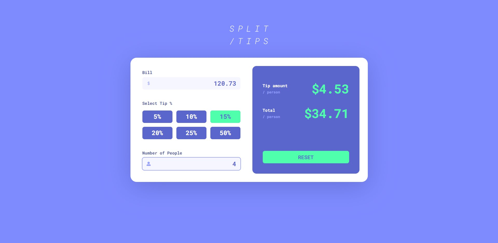

# SPLIT /TIPS

> SPLIT /TIPS is a tip calculator app built with React using React Hooks. You can check it here: https://splittips.netlify.app

## Table of contents

* [About project](#about-project)
* [Screenshots](#screenshots)
* [Technologies](#technologies)
* [Setup](#setup)
* [Features](#features)
* [Status](#status)
* [Contact](#contact)

## About project

"SPLIT /TIPS" is a tip calculator app with a clear and user-friendly interface that makes calculating tips simple.
This project started with a desire to learn React Hooks.

## Screenshots

## Technologies

* HTML, SASS Preprocessor, JavaScript
* React.js
* React Hooks

## Setup

Clone this repo and run "npm install" in your terminal to install all the dependencies

## Features

* User-friendly, fully responsive interface
* Real-time tip calculation based on input

## Status

Project is: _finished_

## Contact

If you interested in working with me, feel free to contact me at: <r0llit@protonmail.com> !
